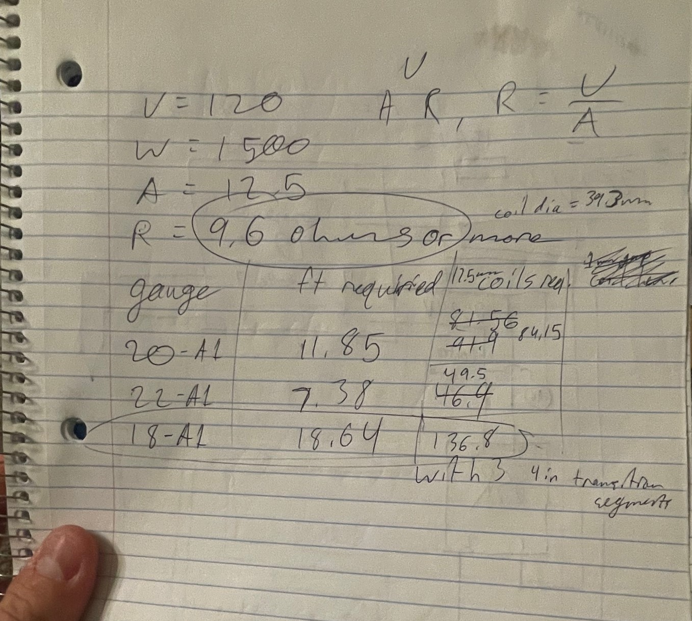

+++
title = 'Kiln Projects'
date = 2025-01-05
draft = false
categories = [
    "engineering",
    "3D printing",
    "projects",
    "metallurgy"
]
tags = [
    "kiln",
    "electronics",
    "WIP"
]
+++

## The Long Term

&emsp;In the 1960s, there was an alloy called MagThor. It had incredible material properties, especially at high temperatures. It was used on the X-15 spaceplane, aviation engines, and missiles. The alloy's patent [(#2,822,267)](https://patentimages.storage.googleapis.com/39/2e/6b/8ddb6a765a5571/US2822267.pdf) describes a variety of mix ratios including varying amounts of magnesium, zinc, zirconium, and *thorium*. Given thorium's radioactivity and toxicity, this alloy was discontinued in the 80s, and modern materials can out-perform MagThor in most cases.

&emsp;But what if we could substitute the thorium for another, similar element? If the strength of MagThor is based on the physical size of the atom in the metal, then lanthanum should serve as a similar substitute, as thorium and lanthanum have similar atomic sizes. If it's based on the electron configuration, then cerium might work, given its position above Thorium on the periodic table (though my knowledge of metallic chemistry is almost non-existent, so cerium might not be the best substitute). If it's largely based on thorium's high melting point, then maybe another high-temperature metal could work, like chromium?

&emsp;I want to experiment. At university, I (theoretically) have access to materials testing labs that could actually help me get real data. This could be a cool way to try something new. It *probably* won't work, but I can't find anyone who's actually tried lanthanum alloys on the internet. I might as well try, I'll learn a bunch of cool stuff on the way.

## Melting Magnificent Metals

### The Kiln Block

&emsp; I need to make a kiln to melt metals. I can't really keep volatile fuels in my dorm so a proper forge is out of the question, but a small electric kiln should work well. Magnesium needs to be melted under an argon atmosphere, so I'll need something rather small and airtight as the heating vessel. I also want the kiln to be able to get hot, far above magnesium's melting point, so a small kiln is preferred. Turns out firebricks are expensive at Home Depot, so I really wanted something small.
&emsp; So I came up with a micro-kiln. It's made out of seven bricks, furnace cement, and is ruthlessly optimized to fit *exactly* one soup can as the crucible. A soup can isn't quite as stupid as it seems - they're made of stainless steel and melt at a much higher temperature than most of the metals I want to melt, including magnesium, and if I ever want to scale up to steel smelting, then small graphite crucibles should still fit.
&emsp; I decided to use the 9 x 4.5 x 2 inch firebricks available at Lowes because they were what I had. These aren't ideal - alumina bricks or a ceramic/refractory wool lined bucket are better setups, and example builds pretty easy to find on the internet. However, I couldn't find a local supplier for alumina bricks or ceramic wool, so bricks it was. I originally thought the bricks were really expensive, but I was able to find a special discount to keep my costs low. This could lead to issues, as I don't know if my bricks will crack at my required temperatures but there's only one way to find out. I modeled the bricks in CAD beforehand and planned my assembly, but you could easily do similar planning by drawing the bricks on paper or making a scale model. 
&emsp; To stick the bricks together, I just glued them with furnace cement. It was cheap at Lowes and made for my target temperatures - what more could I ask for? It's made of kaolinite and silica, basically the same stuff as the bricks, so there's no reason it shouldn't work.

### The Electronics 

&emsp; I did some basic back-of-the-napkin math to determine how much Kanthal heating wire I need - at the 1500 watts that most residential outlets are rated for, I need 9.6 ohms of resistance or more, calculated just with Ohm's Law. Referencing Kanthal datasheets, this works out to 18.6 ft of Kanthal A1 18-AWG wire, or 136 coils of .5in diameter, which should fit nicely in the corners of my kiln. Nichrome wire could also work, but is rated for lower temperatures and is apparently less durable. Your specific wire specs can be calculated for your specific needs, but make sure to double-check the wire length you calculated with a multimeter and give yourself extra. It's easier to cut wire than to add more. 

&emsp; The electronics box is actually dead-simple. The "brain" is an RX-C100 PID industrial temperature controller. It's dead-simple and dead-stupid, exactly what I need. It's wired into a basic K-type thermocouple and a solid-state relay, which is what actually shunts wall power to the coils. I drew the entire wiring diagram in a notebook, printed a basic electronics box, and wired it all together with the thickest cable I could find. Most if it was made with parts from old projects, so this was actually the cheapest part of the project. It looks a *little bit* like a bomb, but it should get the job done. I'll need to plug it into a power stick or GFI and be *very* careful never to mess with it while plugged in. 

### V1 (1/15/2025)

&emsp;The kiln block was put together with home depot furnace cement, and the bricks that needed to be cut were cut on a masonry saw. 
That was pretty easy - basically adult lego. 

&emsp;The electronics box was put together in an afternoon. All the parts I had on hand, and I simply followed my diagram. 
It was my first time using a wire crimper, and now I'll have to use them everywhere because it makes everything so much easier. 
Whood'a thought using the right tool for the job would make things easier?

&emsp;The wire was twisted over a 3D-printed jig (read - cylinder with a hole to hold the wire) of the right diameter. 
I could have used a dowel, but I'd have needed to go out and buy one, and I had a 3D printer on hand. The wire was more 
resistant to twisting than I thought it'd be, and it was kind of a pain to mount in the block. I mounted the wires to the 
block with small tacks of mortar.

&emsp;This arrangement was... unsatisfactory. I bought "firebrick," which is apparently not the same thing as "insulating firebrick,"
often just referred to as "firebrick." Turns out firebrick is made of a special type of clay while insulating firebrick is made of 
ceramics blown to be porous, kinda like pumice. Makes me think about how useful pumice-filled concrete could be...

&emsp;Anyways, the regular firebrick simply wasn't a strong enough insulator. The outside of the block wasn't much cooler than the 
inside, and 1800 watts definitely wasn't enough to counteract the heat losses. I was just *barely* able to hit 500C, but that's not enough.
The first version was also shamefully crude, with the heating wires kinda just hanging around. This was a bad idea and very quickly fell apart.

### V2 (2/26/2025)

&emsp;For the second version, I bought some insulating firebrick. This stuff is super expensive and fragile, so I have to be careful. I'd 
originally considered Kaowool, but bricks were simply easier to deal with and I know more about their properties. To deal with the fragility 
of the bricks, I assembled the kiln and covered it in home depot fire cement. This was, in hindsight, probably not the best idea - a proper 
refractory cement would have likely been the proper material. The furnace cement *works*, but it's been somewhat fragile and seems to have converted 
to a sort of glassy material on any hot surfaces. It also smells awful during first burn-in as all the residual water evaporates.

&emsp;The electronics are the same, but the heater wire changed to be less janky. I carved small indentations in the bricks to fit the coil 
around the equator of the hot chamber. This change in the length of the coil necessitated a change in the coil itself - I chose 20AWG Kanthal-A1 
wound in a ~1/4th in coil around a screw. The screw was useful, as it helped me ensure that the coil spacing was consistent during initial winding. 
Afterward, I stretched the coil to fit the channels I'd carved.

### V2 Updates (3/13/2025)

&emsp;Well, it's not perfect. In particular, I think I bought the wrong kind of mortar compound. It's cracking all over, and isn't very stable. Proper 
refractory compound would have been better, but I can't really fix it now. Best to remember it for the next version. 

&emsp;The wires have also proven difficult. They contract when cooling, which has led to some of them falling off their perch. I also don't dare to 
try to fix them, as they become very brittle with heating/cooling cycles. If I make a future version, I'll have to embed a perch into the walls such 
that the coils can't escape, or I'll have to find a way to pin them. 

&emsp;The size limitation of the kiln has also been something of a problem. I didn't really think about it too much when I first made it, but the kiln 
really limits my ability to make molds. While sure, I can melt down a half-kilo of metal at a time, I can't really fire molds big enough to accept that 
much metal. The molds also have to be fired for a long while, so I don't really want to fire them with a fuel-based forge if I can. While I do eventually 
want to make something ran on fuel, that can become expensive and somewhat hazardous if ran for too long. However, the forge I'm planning on making 
should run on waste oil, which is basically free... Options, options. 

## Investment Casting

&emsp;Investment casting is a relatively simple casting process in principle, but unfortunately gets rather hard to do as an amateur. For one, there aren't too many resources on workflows, especially if you don't have the money for a ton of equipment. I've been coagulating all the methods I've seen on the internet and trying to develop a decent workflow for lost-PLA investment casting.

### Casting Procedure (4/19/24)
Im still working on a procedure for lost PLA investment casting, but here's what Ive got so far:

1. Make your positive print. Can be almost anything, but you have to consider venting and tricky geometry. I use the cheapest PLA I can - additives can introduce ash in the burn-out process. You want to use the thinnest walls you can and practically no infill - I use like 15% lightning infill and 1 wall. 

2. I make a filling compound of 2 parts sieved sand, 1 part plaster of paris, ~1/2 part water. This I use to fill in geometry that won't get filled in by the plaster investment. Ideally, this wouldn't be needed, but when you need to consider both printability and casting, Ive found it's needed, especially for smaller details. This is the part I need to improve on the most, I think. 

3. I make a small box out of something disposable, usually cardboard. This is what the investment (casting compound for the negative) will be poured it. After the filling compound has cured, I glue the model to the bottom of the box.

4. I make the investment compound (2 parts sieved sand, 1 part plaster of paris, 1 part water) and pour it into the box. Shake it a bit to make sure the bubbles come out. It'll set in 30 mins, I let it cure and dry for a day afterwards.

5. After drying, burn it out in the furnace. I usually burn it for like 30 mins at 500-600C. This will burn out the PLA, leaving space for the metal. 

6. Remove mold from furnace, put in metal. So far, all I've used is homemade Zamak-12, a zinc-based casting alloy. it'll melt at 550C and can be poured into the mold pretty easily.

7. Wait for the metal to freeze, then quench it. The investment should be somewhat water-soluble, and it tends to pop off as water seeps in and evaporates.

8. Post processing. Depends on the quality of the model, but you usually need to at least remove the sprue.

&emsp;Now, there are a few methods I can see for obvious improvement. For one, increased sprue pressure would certainly be helpful for capturing details in models and making sure the metal can get everywhere in a mold. I've had some decent casts with this method, but a decent number of failures as well. In particular, the investment seems to crack and fray, small chunks coming out and falling into the places where metal should go. This leaves voids of investment in the final part, which is undesirable.
&emsp;[Industrially](https://www.investmentcasting.org/uploads/8/1/9/8/81988734/atlas_of_shell_defects.pdf), this is solved with a ceramic slurry coating, but I don't have that sort of money. One option for low-temp casting might be talc powder based slurry, but that's iffy and will need experimentation. I could also try heating the mold slower to avoid temperature differences between different sections. It might also just be worthwhile getting better with casting. My mold orientation so far has been suboptimal, and I'm sure I could do better with some practice and thought.
