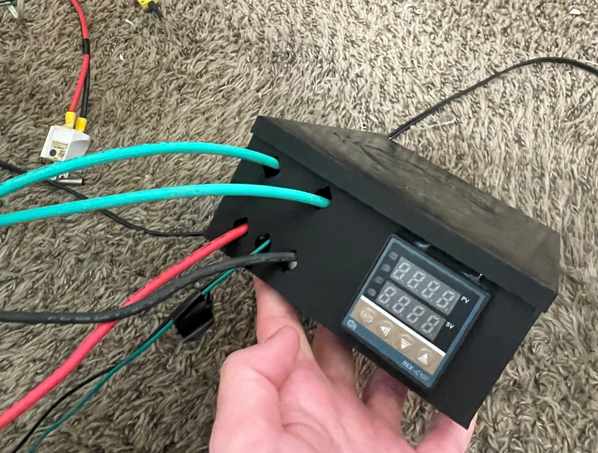
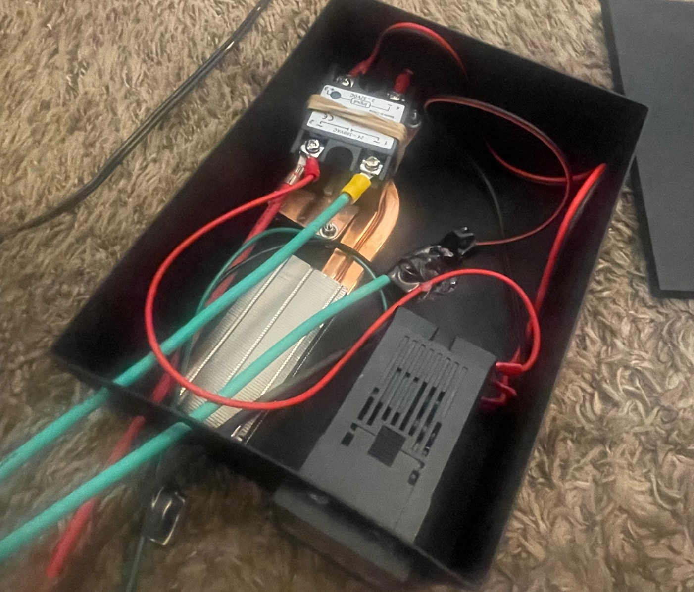

+++
title = 'Kiln Projects'
date = 2025-01-05
draft = false
categories = [
    "engineering",
    "3D printing",
    "projects",
    "metallurgy"
]
tags = [
    "kiln",
    "electronics",
    "WIP"
]
+++

## The Long Term

&emsp;In the 1960s, there was an alloy called MagThor. It had incredible material properties, especially at high temperatures. It was used on the X-15 spaceplane, aviation engines, and missiles. The alloy's patent [(#2,822,267)](https://patentimages.storage.googleapis.com/39/2e/6b/8ddb6a765a5571/US2822267.pdf) describes a variety of mix ratios including varying amounts of magnesium, zinc, zirconium, and *thorium*. Given thorium's radioactivity and toxicity, this alloy was discontinued in the 80s, and modern materials can out-perform MagThor in most cases.

&emsp;But what if we could substitute the thorium for another, similar element? If the strength of MagThor is based on the physical size of the atom in the metal, then lanthanum should serve as a similar substitute, as thorium and lanthanum have similar atomic sizes. If it's based on the electron configuration, then cerium might work, given its position above Thorium on the periodic table (though my knowledge of metallic chemistry is almost non-existent, so cerium might not be the best substitute). If it's largely based on thorium's high melting point, then maybe another high-temperature metal could work, like chromium?

&emsp;I want to experiment. At university, I (theoretically) have access to materials testing labs that could actually help me get real data. This could be a cool way to try something new. It *probably* won't work, but I can't find anyone who's actually tried lanthanum alloys on the internet. I might as well try, I'll learn a bunch of cool stuff on the way.

## Melting Magnificent Metals

### The Kiln Block

&emsp; I need to make a kiln to melt metals. I can't really keep volatile fuels in my dorm so a proper forge is out of the question, but a small electric kiln should work well. Magnesium needs to be melted under an argon atmosphere, so I'll need something rather small and airtight as the heating vessel. I also want the kiln to be able to get hot, far above magnesium's melting point, so a small kiln is preferred. Turns out firebricks are expensive at Home Depot, so I really wanted something small.
&emsp; So I came up with a micro-kiln. It's made out of seven bricks, furnace cement, and is ruthlessly optimized to fit *exactly* one soup can as the crucible. A soup can isn't quite as stupid as it seems - they're made of stainless steel and melt at a much higher temperature than most of the metals I want to melt, including magnesium, and if I ever want to scale up to steel smelting, then small graphite crucibles should still fit.
&emsp; I decided to use the 9 x 4.5 x 2 inch firebricks available at Lowes because they were what I had. These aren't ideal - alumina bricks or a ceramic/refractory wool lined bucket are better setups, and example builds pretty easy to find on the internet. However, I couldn't find a local supplier for alumina bricks or ceramic wool, so bricks it was. I originally thought the bricks were really expensive, but I was able to find a special discount to keep my costs low. This could lead to issues, as I don't know if my bricks will crack at my required temperatures but there's only one way to find out. I modeled the bricks in CAD beforehand and planned my assembly, but you could easily do similar planning by drawing the bricks on paper or making a scale model. 
&emsp; To stick the bricks together, I just glued them with furnace cement. It was cheap at Lowes and made for my target temperatures - what more could I ask for? It's made of kaolinite and silica, basically the same stuff as the bricks, so there's no reason it shouldn't work.

### The Electronics 

&emsp; I did some basic back-of-the-napkin math to determine how much Kanthal heating wire I need - at the 1500 watts that most residential outlets are rated for, I need 9.6 ohms of resistance or more, calculated just with Ohm's Law. Referencing Kanthal datasheets, this works out to 18.6 ft of Kanthal A1 18-AWG wire, or 136 coils of .5in diameter, which should fit nicely in the corners of my kiln. Nichrome wire could also work, but is rated for lower temperatures and is apparently less durable. Your specific wire specs can be calculated for your specific needs, but make sure to double-check the wire length you calculated with a multimeter and give yourself extra. It's easier to cut wire than to add more. 

&emsp; The electronics box is actually dead-simple. The "brain" is an RX-C100 PID industrial temperature controller. It's dead-simple and dead-stupid, exactly what I need. It's wired into a basic K-type thermocouple and a solid-state relay, which is what actually shunts wall power to the coils. I drew the entire wiring diagram in a notebook, printed a basic electronics box, and wired it all together with the thickest cable I could find. Most if it was made with parts from old projects, so this was actually the cheapest part of the project. It looks a *little bit* like a bomb, but it should get the job done. I'll need to plug it into a power stick or GFI and be *very* careful never to mess with it while plugged in. 

### The Construction 

&emsp;The kiln block was put together with furnace cement, and the bricks that needed to be cut were cut on a masonry saw. That was pretty easy - basically adult lego. 

&emsp;The electronics box was put together in an afternoon. All the parts I had on hand, and I simply followed my diagram. It was my first time using a wire crimper, and now I'll have to use them everywhere because it makes everything so much easier. Whood'a thought using the right tool for the job would make things easier?

&emsp;The wire was twisted over a 3D-printed jig (read - cylinder with a hole to hold the wire) of the right diameter. I could have used a dowel, but I'd have needed to go out and buy one, and I had a 3D printer on hand. The wire was more resistant to twisting than I thought it'd be, and it was kind of a pain to mount in the block. I mounted the wires to the block with small tacks of mortar.