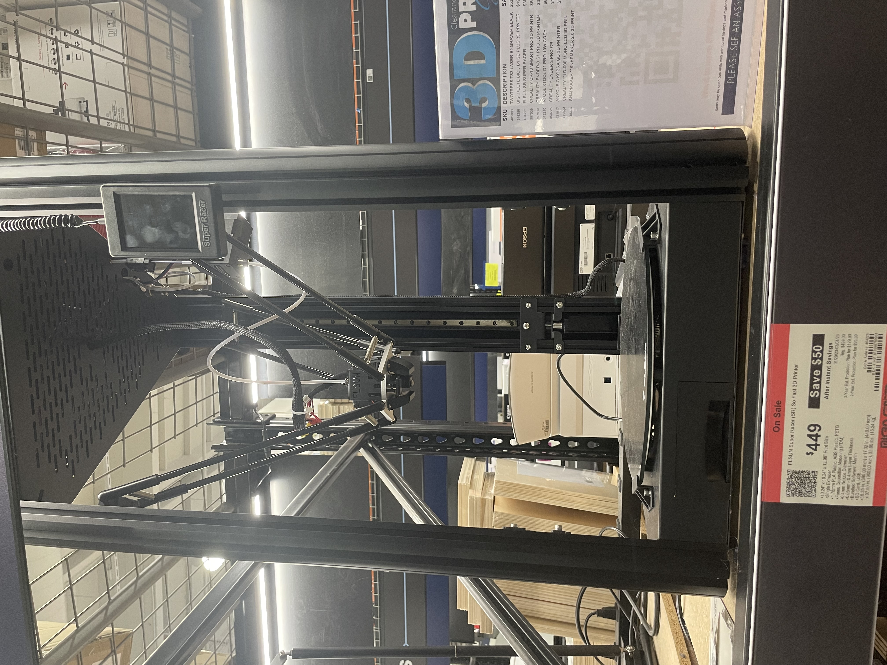
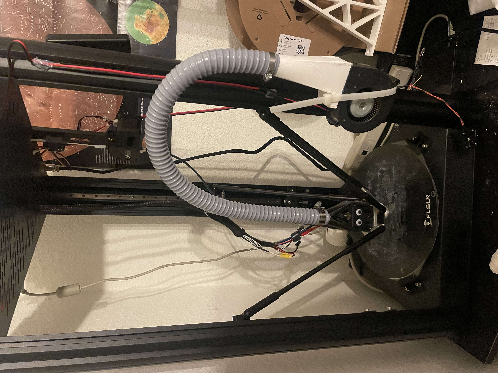
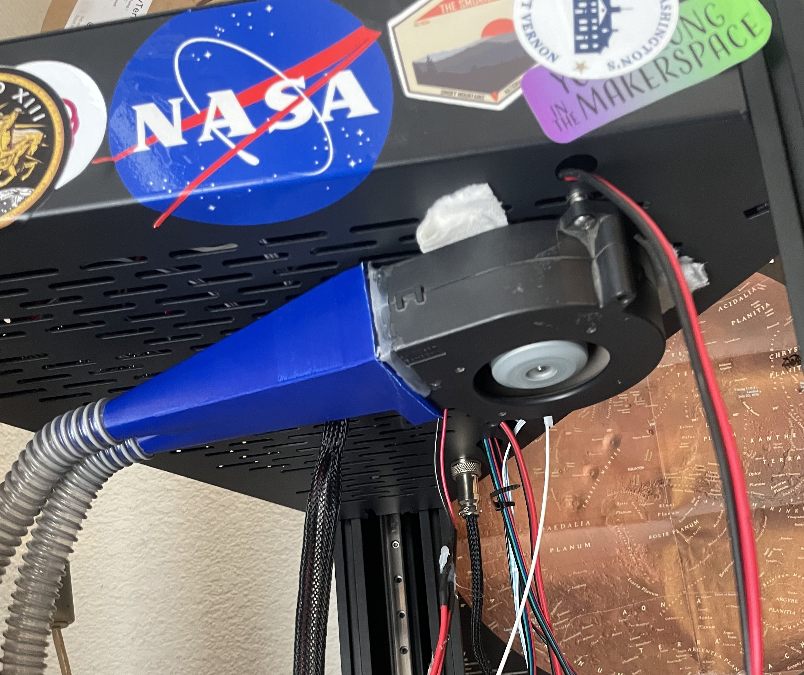
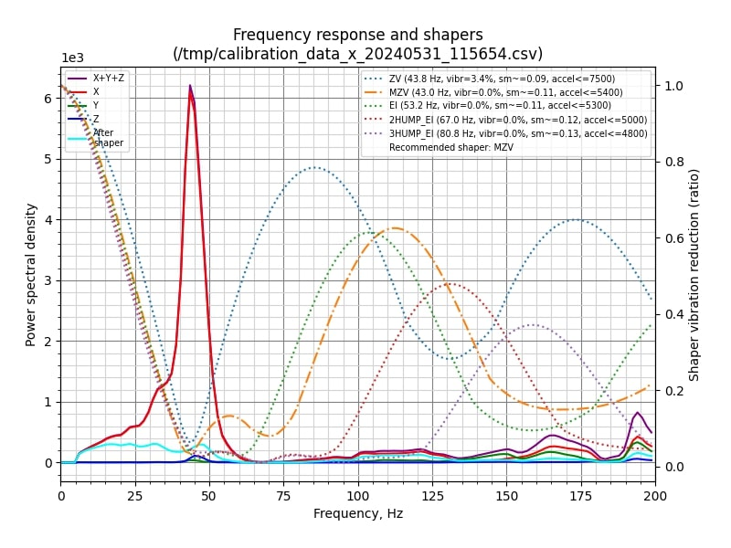
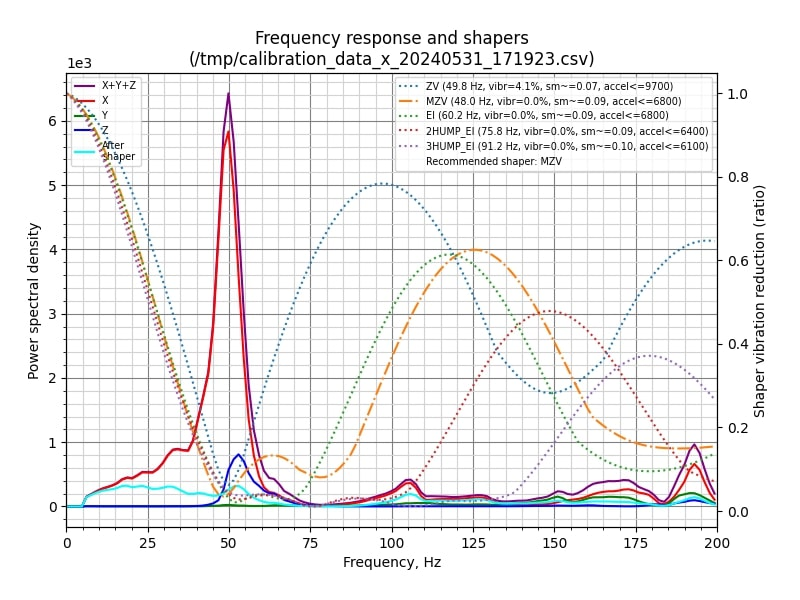

+++
title = 'FLSUN SR upgrades logs + notes'
date = 2024-05-26T12:52:07-07:00
draft = false
categories = [
    "engineering",
    "3D printing",
    "WIP"
]
tags = [
    "upgrades",
    "electronics"
]
+++

## The FLSUN Super Racer

### Stock overview

&emsp;The Super Racer(!) is a delta printer created by the company FLSUN, first released a while ago. Most of its marketing is directed towards its speed, and when I bought it, the printer was a leader in off-the-shelf speed. Marketed with top speeds of 150mm/s and with stock accelerations in the 2-3k range, in the pre-bambu days, that was an impressive speed, and for only ~500 dollars, an impressive price. Sure, the printer was missing some nice features, like direct drive. Sure, it was a pretty weird configuration back when most printer used i3/cartesian systems. But I was sick of my Ender 3's constant requirement for modification and tinkering, this thing came with a bed probe, and I had a very low budget. So, I picked one up on a trip to Microcenter, named it Joshua, and got to work.

Here's a photo of the stock printer:

### Delta weirdness

&emsp;Delta printers are weird. Cartesian and i3 motion systems make intuitive sense, but deltas take a bit more time to get used to. They're pretty far out there compared to the other motion systems, so I'll probably just make a pros/cons list for delta printers. Overall, I love the format because it looks amazing and fits my needs very well.

Pros:

- Fast. Because deltas have 3 motors exerting force for every move, they can be blazingly fast.
- Stable. Since the bed doesn't move, it can be fixed in place. I don't really need to level my bed.
- Simple. This is mostly in comparison to coreXY systems, but deltas are symmetrical and, IMO, pretty easy to get a grasp of mechanically.
- Large print area, though with a circular bed and an emphasis on height.

Cons:

- Time-consuming to maintain. This is more an SR thing, but replacing a nozzle is a relatively time-consuming task compared to other printers.
- Details of the machine can get messy. Software is easy to get "good enough", but not *perfect*. Belt tension can be a royal pain as well.
- Low support. The system is pretty uncommon, so finding support online can be tricky.
- Not enclosed. Not a huge issue for me, but good luck printing HIPS or ABS or anything fancier.
- Speed is *heavily* dependent on toolhead mass. Adding direct drive will kill your speed.

## Upgrades

### Klipper Firmware

&emsp;The first upgrade I tried was klipperization. I'd already klipperized my ender 3, and was somewhat familiar with the software. The SR, however, pushed me to my limits. Given the printer has basically no online documentation, this took me about a month, and I fried my board at one point. Given my difficulties, it's probably for the best I put my experiences online somewhere to help future travelers.

&emsp;First mistake: I didn't use [KIAUH](https://github.com/th33xitus/kiauh). It's by far the best and most useful klipperization tool, and if you aren't using it, I recommend you start right now. It's stupid simple, and it Just Works&trade;.

&emsp;Second mistake: I tried to follow the [Teaching Tech video](https://www.youtube.com/watch?v=Cj7KpzbgExQ). The video itself is very well-made, and Teaching Tech does a great job with his explanations and walkthroughs. The problem is that there was a design change to the SR after this video was made, and now it's entirely outdated. Modern SRs, as far as I can tell, use an MKS Robin Nano V3 board, rather than the BTT SKR V1.3. His "make menuconfig" settings are completely wrong, so here's the settings I found worked for the nano v3:

- STMicroenectronics STM32
- STM32F407 chip
- 48 KiB bootloader
- use a small, preferably 8 gig SD card formatted FAT32 with 4096 grouping.
- set the file name to Robin_nano_v3.bin

&emsp;Third mistake: I probably fried a few boards and pins. Always be careful with wiring, always unplug when changing wiring.

### Klipper Config

&emsp;I'm sorry my config isn't really going to be much help, as I've done a *lot* of fuckery to this printer, and the configs reflect that. I'll [post them for reference](https://github.com/Skippy33/FLSUN-SR-klipper-configs), but *DON'T* copy-paste them. They're for reference, nothing more.

### All-Metal Heatbreak

&emsp;Here's a tip **they** don't want you to know. You *don't actually need a new hotend to have an all-metal hotend*. You can just replace the heatbreak. I just bought a 10$ all-metal heatbreak on Amazon, anything designed for a V6 hotend will do - the specific one I bought was labeled for CR-10s. This is a super cheap upgrade that unlocks PETG and ABS printing, and all you need to do is disassemble the hotend. Overall, a 10/10 upgrade, would highly recommend.

### 5015 Fans

&emsp;This is another pretty good no-brainer upgrade. These fans are pretty cheap on amazon, and have a *wayyy* higher flow than the rinky-dink 4010s the SR comes with. Frankly, I don't know why the printer comes with 4010s, as they're woefully underpowered compared to the printer itself. However, I still found the 5015s underpowered compared to what I wanted, so I changed some more things.

### Fan Ducts

&emsp;Again, the SR comes with some pretty sub-standard equipment. The ducts the printer comes with are *terrible*, and running some tests, I was able to find some ducts on the internet that are a lot better. [This one](https://www.printables.com/model/334581-flsun-super-racer-sr-double-fan-duct) is the one I use, but you should probably experiment with some different models. I found all mine on printables.

### Ducted Cooling

&emsp;This was probably my best upgrade, though it's not for everyone. This is my DIY garage version of the common CPAP cooling upgrade. I had an old fan salvaged from a hulky Stratsys printer a school was throwing out. Initially, I used a single wide tube I'd salvaged from the same printer, and that did work for a while. However, that tube was really stiff, which was messing up my input shaper graphs. Here's an image of the first deported fan build:  Yes, it's jank as hell, but it worked.

Later, I decided on two thin and flexible CPAP tubes. This cleaned up my input shaper graphs and actually provided more airflow. This was the best thing I ever did for my printer's cooling, and overhangs upwards of 60% with PLA and a .6 nozzle are completely feasible and look pretty nice. If it's an option, I'd even recommend skipping right over the 5015 fans.

Here's a photo of the fan and the eventual two tube setup:

### Flying Extruder

&emsp;This upgrade isn't too expensive, and is actually pretty nice, especially if you intend to enclose the printer. You see, the stock extruder sits out from the main triangle, jutting from the top. It works as a configuration, but I wanted to enclose my printer, and the easiest way to do that is to just cover the sides with big flat panels. The extruder gets in the way, and that just won't do. So, I downloaded [this model](https://www.printables.com/model/84444-flystruder-delta-printer-flsun-sr/files) from a lovely frenchman and printed it in PETG. The assembly was pretty easy, only taking a few M4 screws, and I just moved the stock extruder onto the plate, and presto, a flying extruder was born! I did also need to wire it up with bungee cord, but that stuff was pretty cheap. A few tips though -

- The weight of the flying gantry shouldn't matter. Ideally, the motor should be almost completely stationary as the printhead moves, "flying" above the toolhead.
- Make sure the wires are fairly tight. If they're too loose, the gantry will sag, messing with your input shaper graphs.
- If you're using deported cooling, it's a good idea to tie the tubes to the flying gantry.
- There should be no tension on the bowden tube. Tension on the bowden tube will destroy it in the long run.

&emsp;Some people, such as [James Pray](https://www.youtube.com/@jamespray/videos), will build a flying gantry without the bungee cords, instead using assemblies of springs and printed dampners. The main advantage of this setup is that the extruder can be closer to the hotend, reducing the length of the bowden tube. However, this system has a few disadvantages that make it impractical for me. This sort of system is more complex and expensive, two things I am not a fan of.

&emsp;I left the filament switch dangling after I removed the bar mounting it. I just push the filament through the switch and leave it hanging, but I really don't need the switch most of the time, and I could leave a separate piece of filament in there most of the time without issue.

&emsp;Also, I'd recommend using a reverse bowden setup between the flying extruder and the top of the printer. It's a good way to reduce friction along the filament path.

Here's a photo of the flying extruder:

### CHC Hotend and CHT Nozzle

&emsp;I'm not too sure on this upgrade. They're cheap enough through TriangleLabs on Aliexpress, and do offer some benefits over the stock hotend - it seems faster anecdotally, and they heat up *wayyyy* faster. For 12 dollars, I'd recommend a 60-100W heater as a replacement for when your stock hotend gives out. The CHT nozzle, however, is a must-have if you want high flow rates. Anecdotally, I was noticing a ~%33 increase in volumetric flow. I don't have the equipment to do a proper, rigorous flow test, but given that volcano CHT nozzles are nearly the same price as regular volcano nozzles through Aliexpress, it's an upgrade I'd highly recommend.

### Ultralight Effector

&emsp;This is maybe the first upgrade where I've actually questioned its necessity. I uploaded the model to printables [here](https://www.printables.com/model/897132-flsun-sr-ultralight-effector), but I don't think I'd recommend it to anyone but the most diehard speedsters. I originally printed the effector in CF-PETG, and while it was much lighter than my mostly-stock effector (135g instead of 211g), it was also not stiff at all. The lack of stiffness led to terrible input shaper results despite the reduced weight. Part of that is likely my plastic, as the "carbon fiber" in the CF-PETG I was using was mostly aesthetic. Reprinting in PLA led to input shaper near-equivalent to the stock effector. In dicussion with some delta printer gurus such as [cophaeler](https://www.youtube.com/@jamespray/videos), I was pointed to another issue that could be leading to my input shaper spikes - frame stiffness. I've attatched my input shaper graphs, and even with quite different configurations, the peak at 50hz is very consistent. This points to frame (or possibly table) stiffness as a greater contributor to vibrations in my case. I'll do some more experimenting and investigating, especually the possibiltiy that I need to tighten some screws or check my flying extruder setup. In the meantime, I'll say this upgrade has dubious value.

PETG graph -

PLA graph -

## Conclusion

&emsp;So, what did I get out of all of this? At the start, stock speeds were ~150mm/s at 3k mm/s^2. The deported cooling and klipperization got recommended accelerations to ~6k and top speeds of ~250mm/s. Making the tubes more flexible, and those accelerations are pushed to ~10k. I haven't ran any speedbenchies, but print times are between 1/2 and 1/3 stock times, depending on the print. Overall, for the price, it wasn't that bad. And to be honest, I really liked the process of modifying and building up the printer to its current capabilities. However, my biggest cap hasn't really changed - flow rate. I can't really figure out how to increase flow rate without decreasing my bank account or increasing temperatures past reason.