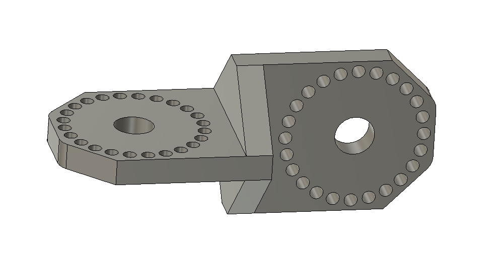
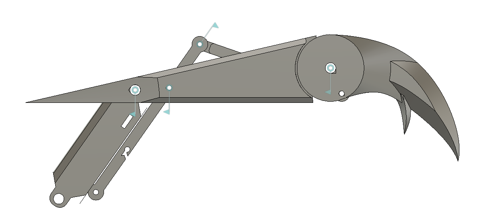

+++
title = 'GIANT ROBOT ARMS!!!!'
date = 2024-06-15T21:04:13-07:00
draft = false
categories = [
    "engineering",
    "3D printing",
    "projects"
]
tags = [
    "science fiction",
    "crazy ideas"
]
+++

## The Inspiration

&emsp;In December 2023, I watched a bit too mujch TV. For some reason, I really liked the idea of robot arms. The idea had already been in my head for a while thanks to the show Inside Job, where one of the main characters invents GIANT ROBOT ARMS(!!!!). There were also a few animations where characters had mechanical wings, and I thought they looked *really* cool. So, I decided I had to make some of my own and wear them for my last day of school. I had a 3D printer and six months to spare, it couldn't be *that* hard. Right? This would be my first real *big* project, and as such, has proved to be a valuable lesson in "dos" and "don'ts".

## Conceptual Design 

&emsp;When I built the project originally, I wasn't thinking in terms of conceptual and detailed design, buit I did have a vague concept of what I wanted to do. First, I wanted the arms to be big and bulky - that's kinda the point. They were built to look cool, not to be useful. They still had to fit through doors, but not necessarily well. They had to be able to be constructed, like lego or technic bricks, so I could take them apart and carry them in a bag. The hands also had to look imposing and impressive. That's vague, but it implies that it'll need to be large and *look* complicated. 

## Arm Design

### Base

&emsp;I decided to build the whole thing to fit inside an old backpack because that was the cheapest way I could think to make something that I could put on my back. I designed a backplate that was glued into the backpack, keeping the whole system rigid and providing attachment points. I also put some giant weights in the backpack as ballast against the weight of the arms in front of me.

### Interlocking Arms

&emsp;I originally designed two types of arms "single" and "interlocking." The single arms were a single 30cm long print, while the interlocking arms were three joined prints coming to 60cm long. Problem is, I underestimated how *big* 60cm is. I guess my American brain just isn't used to intuiting metric measurements, and in practice, the interlocking arms were way too big. The single arms were plenty long enough and could be combined pretty easily. They were also easier to carry, so whenever I wore the arms, I only used single arm segments.

### Omnidirectional Joints

&emsp;This is probably the worst-designed part of the assembly. Realistically, I should have gone with a design closer to the Inside Job animation, with bulkier and thicker joints that didn't have so many thin sections. 

Here's an image of the final design:

&emsp;Given how thin most of the part is, it was the most common point of failure. While it did meet design requirements on a small scale, I'd failed to think about it as part of the whole system and an actual load-bearing part.

### Rotational Joints

&emsp;In hindsight, these were a terrible idea. I'm not going to give them more than a few sentences because they just fell apart and didn't work at all. The problem they were meant to solve could have been fixed by using the Inside Job joint design.

## Hand Design

### Palm

&emsp;The palm was a pain to design, given its weird angles. I don't really want to mention it, to be honest. It just took a lot of time. I originally designed it so that the hand could articulate, but after some real-life testing, that was quickly shown to be impractical. I had a hard time making the palm large enough in relation to the fingers but small enough to fit on my build plate. 

### Metacarpal, Phalanx, and Claw

&emsp;These parts were designed together, and honestly, I think I did a decent job at making them feel intimidating. These were held together with 3D printed pins and pressure-fit nuts. This actually worked pretty well, and when held in position by the actuator rods, they looked *really* cool. There was an early version that used a giant block as a hand and the fingers were just single printed parts, but assembly would have been hard and the whole design didn't look very good anyways. 

### Actuators

&emsp;These were the parts that were supposed to move the hands - the small linkages on the image above. I'd originally tested these with a cardstock and thumbtack 2D model, where it actually worked pretty well. Practically, though, the actuators didn't do much more than look cool. There wasn't an effective way to pull on them and they took too much force to move.

### Manipulator Hand

&emsp;I haven't really mentioned it, but I made two models of hand. The one I've described above took more time to design, but I also made a manipulator hand based on those helping hand things you can get for soldering. I ended up just downloading a helping hand segment from the internet and adapting a bunch of them into a hand. This ended up working *really* well, and in the end the hand looked amazing. I also designed smaller claws for the ends of the manipulator fingers. I did, however, overestimate the strength of the ball joints, and they had a habit of sagging. This was probably down to tolerances, and I could have maybe designed my own segment system, but that would have taken more time and effort.

## Wearing It

&emsp;I did a few test fits at home before the final day, and naturally found a bunch of major issues. The backboard broke, the arms were *way* too long, the joints were too weak. This is a **great** lesson in testing things. I also figured out how to take the thing through doors, which proved surprisingly hard.

&emsp;On the day I took it to school, it actually went really well. I had to remove anything that looked remotely sharp because of bureaucratic fun-sponges, but it was still impressive and quite a few people got a good laugh out of it. The arms sagged precipitously, but it ultimately worked. At one point, the clawed hand snapped off and the attachment point broke, but I was able to bodge it back together with spare parts I'd brought.

## Takeaways

1. Document everything while building, and keep a journal of ideas. This would have made it a lot easier to write this post, and it's an essential skill for actual engineering. I seem to enjoy recording and documenting in a markdown format like this website, so maybe that's how I should do it in the future.
2. Plastic is flexible! Who'da thunk it. The lever forces on the arm made it sag more than I'd hoped.
3. 3D printing is NOT the hammer for every nail. Building this from foam and/or aluminum extrusion would have been much lighter and more rigid. However, 3D printing **is** much easier, and amazing for prototyping.
4. Actuation is hard. It's probably easier to put small motors wherever you need something to move and just run electrical lines.
5. Think through the practical forces. How is something going to *feel*, how is it going to work, and assume that plastic parts aren't that strong.
6. Leave more time than you expect to need. I started this project 6 months early, which gave me plenty of time to think it all through and fix issues before the final day.
7. Test everything ALL THE TIME.
8. Bring spares. No plan survives contact with the enemy, but planning helps you be prepared for *when* things go wrong.
9. Rule of Cool works in fiction, but reality has a low-tolerance policy when it comes to bad physics. 
10. Have realistic and stretch goals. From the very beginning, actuated hands were a stretch goal. When that didn't work out, I was able to revert to a "dumb" system that still looked cool.