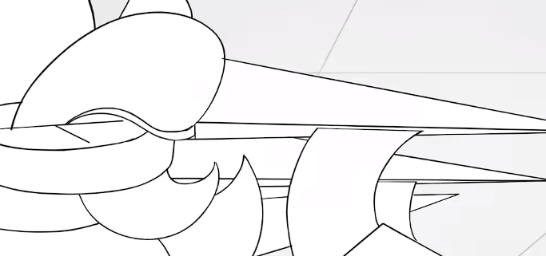
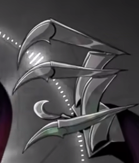
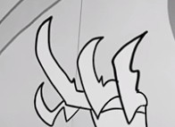
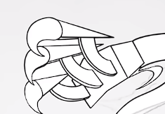
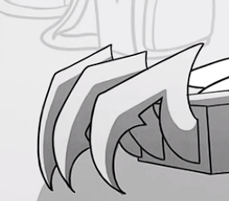

+++
title = 'GIANT ROBOT ARMS!!!!'
date = 2024-06-15T21:04:13-07:00
draft = false
categories = [
    "engineering",
    "3D printing",
    "projects"
]
tags = [
    "nerd shit",
    "science fiction",
    "crazy ideas"
]
+++

## The Inspiration

&emsp;In December 2023, I watched an [animation by Liam Vickers on youtube](https://www.youtube.com/watch?v=RgNz7ltN-Nk) about a character named IC-0n. IC-0n's gimmick is that she's basically omnipotent, goofy, and has a penchant for murder. And while this specific combination captivated me for a few months, I *really* liked IC-0n's giant robot arms. The idea had already been in my head for a while thanks to the show Inside Job, where one of the main characters invents GIANT ROBOT ARMS(!!!!). There were also a few animations where characters had mechanical wings, and I thought they looked *really* cool. So, I decided I had to make some of my own and wear them for my last day of school. I had a 3D printer and six months to spare, it couldn't be *that* hard. Right? This would be my first real *big* project, and as such, has proved to be a valuable lesson in "dos" and "don'ts".

## References

### IC-0n

&emsp;I didn't have much to go on. The hand I wanted to base on IC-0n's talons, and the arm segments on Inside Job, but not much more. Most of the content I used was also animated, and the animators hadn't really worried about the mechanical or physical feasibility of their arms, so I had a tough time trying to figure out what exactly to build. I took a few screenshots and tried to piece together exactly what I needed.

&emsp;Unfortunately, the IC-0n screenshots are wildly inconsistent and mechanically impossible. Fortunately, this gave me a *lot* of artistic license to make design and manufacturing simplifications. I decided to go with a hand design similar to the top images and bottom-center images, as those seemed to be the most realistic. Each finger would be built with a metacarpal, phalanx, and claw, or the first, second, and third segments respectively. I'd use three fingers and a thumb, each with the same standardized construction. 

&emsp;The boxy palm seen in IC-0n's character art was an almost immediate no-go. It would have been hard to assemble and probably exceeded my build volume. I decided to design the palm as a much more open frame, looking more like the tendons in your hand. Originally, I also wanted to be able to actuate the hands with a bowden cable, which necessitated a more complicated design with actuation levers.

### Inside Job

&emsp;I knew that this would be *really* hard to recreate in real life, because this design is basically impossible. The arms should be too heavy for Reagan to hold on a small backpack, the arms get *wider* as they get farther from the base, and the hands are just ridiculous - they were made to look cool as hell, not to be mechanically accurate. But I wanted to make something that *looked* similar and had the same feel.

&emsp;In the end, I decided that I'd go for a similar cylindrical design for the arms, but with *very* different joints. This may have ultimately been a mistake.

## Arm Design

### Base

&emsp;I decided to build the whole thing to fit inside an old backpack because that was the cheapest way I could think to make something that I could put on my back. I designed a backplate that was glued into the backpack, keeping the whole system rigid and providing attachment points. I also put some giant weights in the backpack as ballast against the weight of the arms in front of me.

### Interlocking Arms

&emsp;I originally designed two types of arms "single" and "interlocking." The single arms were a single 30cm long print, while the interlocking arms were three joined prints coming to 60cm long. Problem is, I underestimated how *big* 60cm is. I guess my American brain just isn't used to intuiting metric measurements, and in practice, the interlocking arms were way too big. The single arms were plenty long enough and could be combined pretty easily. They were also easier to carry, so whenever I wore the arms, I only used single arm segments.

### Omnidirectional Joints

&emsp;This is probably the worst-designed part of the assembly. Realistically, I should have gone with a design closer to the Inside Job animation, with bulkier and thicker joints that didn't have so many thin sections. 

Here's an image of the final design:

&emsp;Given how thin most of the part is, it was the most common point of failure. While it did meet design requirements on a small scale, I'd failed to think about it as part of the whole system and an actual load-bearing part.

### Rotational Joints

&emsp;In hindsight, these were a terrible idea. I'm not going to give them more than a few sentences because they just fell apart and didn't work at all. The problem they were meant to solve could have been fixed by using the Inside Job joint design.

## Hand Design

### Palm

&emsp;The palm was a pain to design, given its weird angles. I don't really want to mention it, to be honest. It just took a lot of time. I originally designed it so that the hand could articulate, but after some real-life testing, that was quickly shown to be impractical. I had a hard time making the palm large enough in relation to the fingers but small enough to fit on my build plate. 

### Metacarpal, Phalanx, and Claw

&emsp;These parts were designed together, and honestly, I think I did a decent job recreating the feel of IC-0n's hands. These were held together with 3D printed pins and pressure-fit nuts. This actually worked pretty well, and when held in position by the actuator rods, they looked *really* cool.

### Actuators

&emsp;These were the parts that were supposed to move the hands - the small linkages on the image above. I'd originally tested these with a cardstock and thumbtack 2D model, where it actually worked pretty well. Practically, though, the actuators didn't do much more than look cool. There wasn't an effective way to pull on them and they took too much force to move.

### Manipulator Hand

&emsp;I haven't really mentioned it, but I made two models of hand. The one I've described above took more time to design, but I also made a manipulator hand based on those helping hand things you can get for soldering. I ended up just downloading a helping hand segment from the internet and adapting a bunch of them into a hand. This ended up working *really* well, and in the end the hand looked amazing. I also designed smaller claws for the ends of the manipulator fingers. I did, however, overestimate the strength of the ball joints, and they had a habit of sagging. This was probably down to tolerances, and I could have maybe designed my own segment system, but that would have taken more time and effort.

## Wearing It

&emsp;I did a few test fits at home before the final day, and naturally found a bunch of major issues. The backboard broke, the arms were *way* too long, the joints were too weak. This is a **great** lesson in testing things. I also figured out how to take the thing through doors, which proved surprisingly hard.

&emsp;On the day I took it to school, it actually went really well. I had to remove anything that looked remotely sharp because of bureaucratic fun-sponges, but it was still impressive and quite a few people got a good laugh out of it. The arms sagged precipitously, but it ultimately worked. At one point, the clawed hand snapped off and the attachment point broke, but I was able to bodge it back together with spare parts I'd brought.

## Takeaways

1. Document everything while building, and keep a journal of ideas. This would have made it a lot easier to write this post, and it's an essential skill for actual engineering. I seem to enjoy recording and documenting in a markdown format like this website, so maybe that's how I should do it in the future.
2. PETG is super flexible and not great for many engineering purposes. The arms sagged more than I'd expected.
3. 3D printing is NOT the hammer for every nail. Building this from foam and/or aluminum extrusion would have been much lighter and more rigid. However, 3D printing **is** much easier, and amazing for prototyping.
4. Actuation is hard. It's probably easier to put small motors wherever you need something to move and just run electrical lines.
5. Think through the practical forces. How is something going to *feel*, how is it going to work, and assume that plastic parts aren't that strong.
6. Leave more time than you expect to need. I started this project 6 months early, which gave me plenty of time to think it all through and fix issues before the final day.
7. Test everything ALL THE TIME.
8. Bring spares. No plan survives contact with the enemy, but planning helps you be prepared for *when* things go wrong.
9. Rule of Cool trumps all in fiction, but reality has a low-tolerance policy when it comes to BS physics. 
10. Have realistic and stretch goals. From the very beginning, actuated hands were a stretch goal. When that didn't work out, I was able to revert to a "dumb" system that still looked cool.