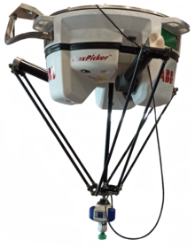

+++
title = 'Rotary Delta Project'
date = 2024-10-15T11:30:37-07:00
draft = True
categories = [
    "engineering",
    "3D printing",
    "projects"
]
tags = [
    "education",
    "electronics"
]
+++

## The Inspiration

&emsp;I learned about these after googling "delta robot" in search of information on the FLSUN SR project. Turns out there's multiple types of delta robot, the 3D printer being a linear delta. Linear deltas are relatively complicated compared to rotary deltas, but are more accurate. Since 3D printing requires high accuracy, you basically never see rotary delta printers.

&emsp;You do, however, see rotary deltas in industry extensively as pick-n-place machines. Their high speed, large envelope, and relative simplicity means they're ideal for many simple factory operations. Rotary deltas also just look *really cool*, and I thought building a rotary delta machine would be a great educational opportunity. And seriously, look at this thing. It's gorgeous. 

## Conceptual Design

&emsp;There wasn't much here that's explicitly required, since I wasn't designing to any spec other than my own. The resources available to me did constrain my options, though.

1. Must be cheap. The budget was a vague < $50.
2. I must make an actual delta robot that works.
3. I must program both forward and inverse kinematics.
4. I must complete this before the SHPE conference.

## Detailed Design

&emsp;There's a lot of nice simplifications I can take because of the low requirements. Accuracy isn't a big concern, so 3D printed parts and press-fits are going to make manufacturing much easier. I can just breadboard all the electronics and get away with a pi pico microcontroller. No need for batteries or a PSU, since I can just power the pico with USB and the servos with the pico's 5V output. Smaller machine size means I can use small 5V servos, meaning I don't need any sort of servo driver. Strain relief, automatic calibration, and tons of other features required for any industrial setting aren't necessary, since I don't intend to actually use the machine for anything serious and I can manually calibrate the machines.

## Prototype 1

&emsp;I somehow don't have a photo of this version, but that's probably because it didn't work. I'll make a list of everything that went wrong, and later elaborate on how I fixed the issues.

1. Printed forearms are a bad idea. They're too flexible, so the effector just flops around.
2. I needed shorter upper arms to reduce strain on the motors. The little 5V servos couldn't provide the torque I needed.
3. Breadboards would make the programming *much* easier.
4. End-rod bearings or cupped bearings are the way to go for the universal joints, just relying on play in screws won't work.

## Prototype 2

&emsp;This time, I decided to be a bit more careful. I was able to model most of the machine entirely in Fusion360 (though one of the arms just refused to join properly, I don't know why). This also allowed me to figure out what joint angles my end rod bearings needed to be. This prototype ultimately worked well enough to be a testbed for programming.

### End Rod Bearings

&emsp;I just 3D printed the end rod bearings by the dozen. They're not hard to model, and while 3D printed versions are inaccurate, they're also way cheaper than bought from store. I ended up making a standard bearing design for the entire model, held into place by a pin. I designed the pins to be held by set screws, but press fits served me well enough. If I were to design for larger industrial applications, I don't think I'd use end rod bearings given their price. They seem to be pretty expensive, and a full delta machine needs 12 of them. Cupped bearings might be a better solution for industry, but printed end rod bearings serve me well enough.

### Forearms

&emsp;I decided to use aluminum stock forearms, similar to some of the machines I'd seen online. 200mm x 3mm diameter aluminum stock was cheap enough to buy online, and was rigid and long enough for what I needed. This was a great idea, and those aluminum rods were easy to integrate into the full design. It was easy to design the end rod bearings around these, and they were perfect for my design. Also makes it look cooler.

### Math

&emsp;This was the hardest part of the project, mostly because there's very little documentation on the kinematics of this system. The most useful sources for me were the now-defunct Trossen Robotics Forum, archived [here](https://hypertriangle.com/~alex/delta-robot-tutorial/). The kinematic system was originally described in a [patent](https://patents.google.com/patent/US4976582A/en) from the 80s, but contending with patent-speak and mathematician-speak to understand the system was a no-go. I already had trouble understanding the robotics forum, so this was a problem.

&emsp;Luckily, I'm at university now, so I can ask professors for help. Dr. Chen at the University of California Merced helped me greatly. He pointed me to some similar kinematic systems and the wonders that are Matlab and Simulink. I haven't figured out how to make my own Matlab or Simulink programs yet, but some other people made examples of delta kinematics. In particular, [this one](https://www.mathworks.com/matlabcentral/fileexchange/93775-delta-robot) by Dr. Fuh of the National Taiwan Ocean University proved very useful for getting a better understanding of the kinematic system, even though he uses a different notation system to Trossen Robotics. They're very helpful, but the kinematics is ultimately the hardest part for me. A lot of it goes above my head, and there aren't many good sources that explain it. Ultimately, I won't really try to explain it here in fear that my explanation will be incorrect. Those sources were helpful to me, and should serve you well. Breaking down the problem and trying to draw it out myself helped me a lot, so I recommend trying that.

## Media

### Youtube video of robot

&emsp;available [here](https://youtu.be/jdE0xy-rr-U)

### Fusion file of robot

&emsp;available 

## STEP file of robot

&emsp;available 